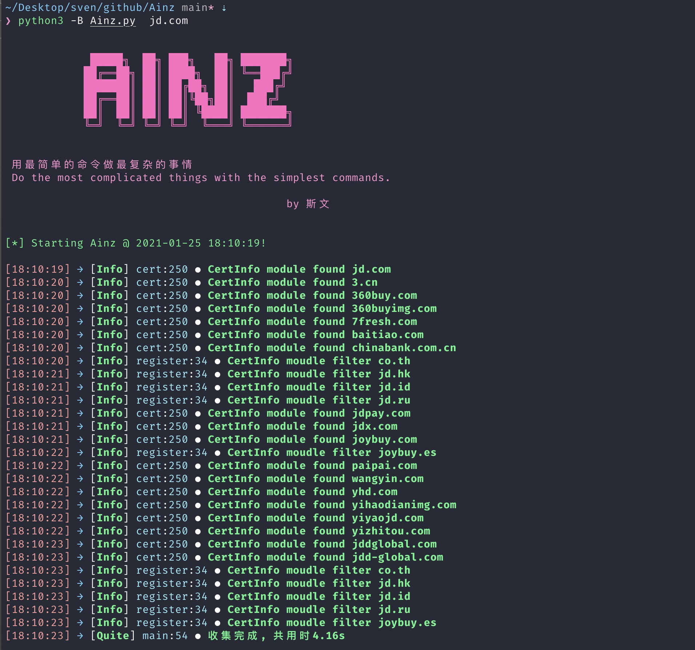

# Ainz

[](https://svenbeast.com)
[](https://github.com/sv3nbeast/Ainz)
[](https://github.com/sv3nbeast/Ainz/blob/main/LICENSE)

Ainz旨在为解决目标资产收集问题的一款目标资产全收集工具

```
安兹·乌尔·恭（アインズ·ウール·ゴウン）
CV：日野聪
种族：死之统治者（Over Lord）
等级：100（种族等级40+职业等级60）
属性：极恶（正义值-500）
本作主角，原名“飞鼠”，“安兹·乌尔·恭”公会长，“纳萨力克地下大坟墓”统治者。
真实姓名为“铃木悟”，是一名忙碌的业务员，父母双亡，没有朋友，在现实世界里过着孤独的生活，因此特别珍视在YGGDRASIL中与公会成员间的友情，即使在成员逐一离开游戏后依然维持着公会等待他们归来。
角色构成为极限特化死灵系类型，魔力量高达1980（普通满级玩家大概在1300左右），能够使用的魔法有718种（一般百级玩家通常只能使用300种）。只论没有玩家技能加持的战斗力在全部玩家里属于中上水准，若考虑全身的神器级装备和付费道具的话可以达到上中等级。十分擅长分析情报，与玩家PK的胜率很高，不过都是放弃第一次胜负后的连胜。结合氪金道具的话可以单挑两个同等级玩家。
```
<code>**安兹擅长收集情报然后击败敌人**</code>


